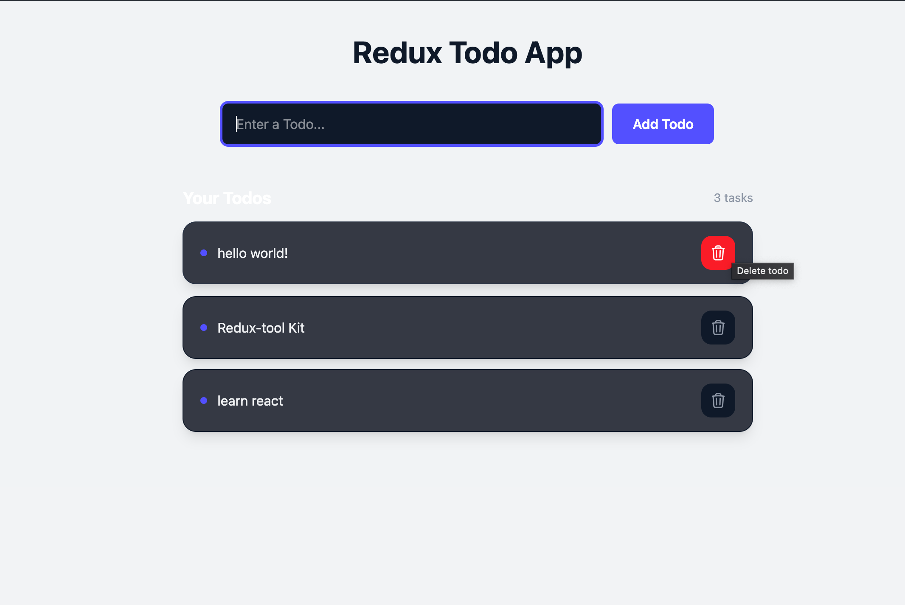

# Redux Todo App

A simple Todo application built with React.js and Redux Toolkit to practice global state management.

## Screenshot

## Live Demo

https://redux-todos-nine.vercel.app/

## Features

- Add todos
- Delete todos
- Redux Toolkit state management
- Responsive UI
- Tailwind CSS styling
- Vercel deployment

## Tech Stack

- React.js
- Redux Toolkit
- React Redux
- JavaScript
- Tailwind CSS
- Vite

GitHub: https://github.com/Annu9111
